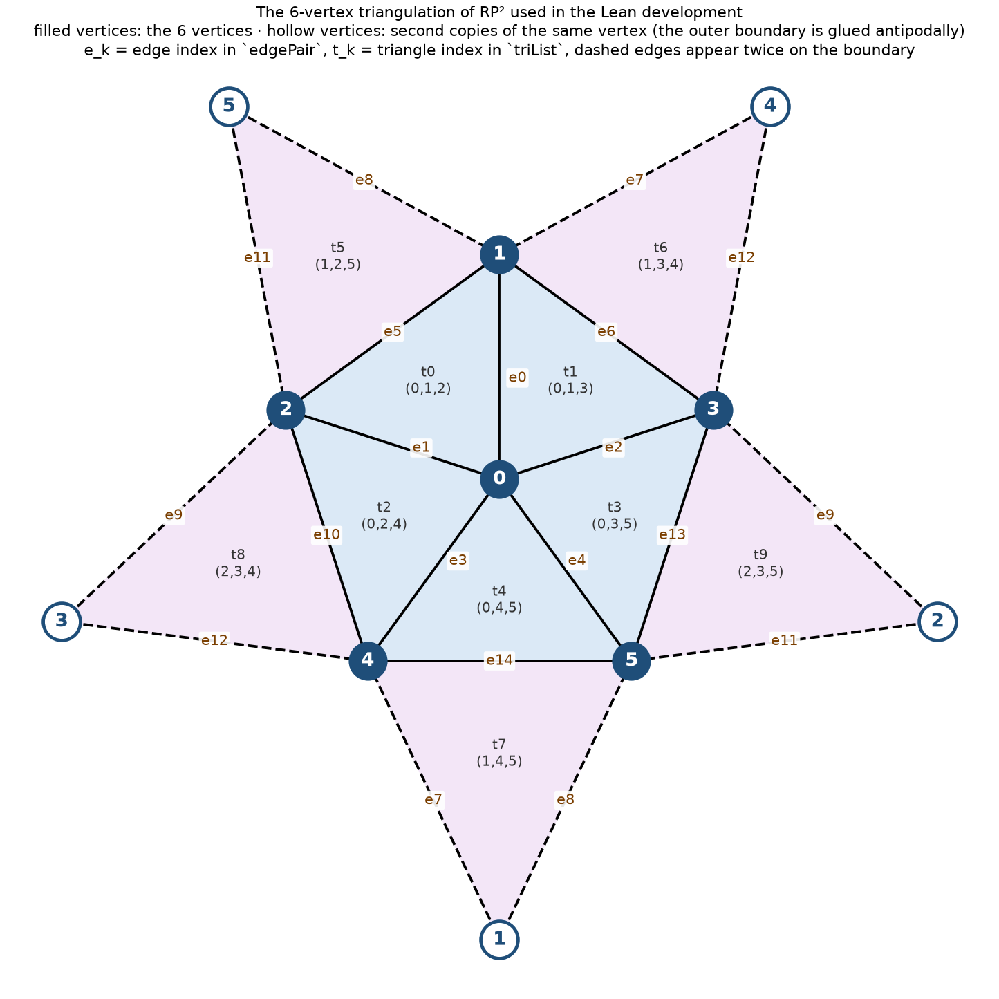

# Simplicial cohomology of RP² in Lean 4: explanation of the verified development

## 0. Background: what cohomology measures, and what RP² is

**Cohomology detects holes and obstructions.** A k-cochain assigns a value to every k-dimensional piece
of a space (vertex, edge, triangle). The coboundary δ measures how a cochain fails to be "consistent"
across neighbouring pieces. A *cocycle* is a cochain with δ = 0: locally consistent everywhere. A
*coboundary* is a cochain that is δ of something one dimension lower: consistent for a trivial reason.
Cohomology is cocycles modulo coboundaries, i.e. the locally consistent assignments that are **not**
globally explained. Each such class is an obstruction, a "hole" the space has in that dimension.

**The coefficients matter.** Over ℤ the values carry a sign and a magnitude, so ℤ-cohomology remembers
orientation and integer multiplicities. Over ℤ/2 the values are just parities, so orientation is
invisible. Comparing the two answers is what exposes non-orientability: RP² has an integer obstruction
that is of order 2 (some class that is not zero, but whose double is), and such a class only exists
because the surface cannot be consistently oriented.

**What RP² is.** The real projective plane is a disk with opposite points of its boundary circle glued
together:

$$\mathbb{RP}^2 = D^2 / (x \sim -x \text{ on } \partial D^2).$$

Walk to the boundary and you re-enter from the diametrically opposite point. The picture in section 1
is exactly this disk: the outer boundary of the figure is a circle and each vertex on it appears twice,
once at each end of a diameter, because those two points are the same point of RP².

**The smallest cell structure.** RP² can be built from one cell in each dimension: one point, one
1-cell (the boundary circle after gluing, which is a circle traversed once), and one 2-cell (the disk).
The 2-cell's boundary runs around the boundary circle of the disk, which after the antipodal gluing wraps
around the 1-cell **twice**, in the same direction. The cellular chain complex is therefore

$$0 \to \mathbb{Z} \xrightarrow{\;\times 2\;} \mathbb{Z} \xrightarrow{\;0\;} \mathbb{Z} \to 0,$$

reading from the 2-cell on the left to the 0-cell on the right. The important part is the ×2. On an
orientable surface such as the sphere or the torus the corresponding map is 0, because the boundary of
the 2-cell cancels itself out. On RP² the two passes around the 1-cell go the same way and add up.

**What that predicts.** Cohomology uses the dual complex (apply Hom(−, ℤ), which reverses the arrows and
keeps the matrices):

$$0 \to \mathbb{Z} \xrightarrow{\;0\;} \mathbb{Z} \xrightarrow{\;\times 2\;} \mathbb{Z} \to 0,$$

now reading from the 0-cochains on the left. So over ℤ:

| group | computation | answer |
|---|---|---|
| H⁰ | kernel of 0 | ℤ |
| H¹ | kernel of ×2, modulo image of 0 | 0, since ×2 is injective on ℤ |
| H² | ℤ modulo image of ×2 | ℤ/2 |

Over ℤ/2 the map ×2 becomes 0, every kernel is everything and every image is nothing, so all three groups
are ℤ/2.

**How this connects to the Lean development.** The Lean proofs do not use this 3-cell model; Lean needs
explicit finite matrices, and the cleanest way to get them is a triangulation. The 6-vertex, 15-edge,
10-triangle triangulation in section 1 is the same space cut into more pieces, so the two coboundary
matrices there (15×6 and 10×15) play the role of the maps 0 and ×2 above, and must give the same answers.
They do, and the ×2 is still visible: over ℤ, the indicator of a single triangle is not a coboundary but
its double is (that is the content of `H2_int_witness` in section 3.5), and the column sums of the
second matrix, all 0 or ±2, are the ×2 spread out over fifteen edges.

## 1. What was proved

The development computes the simplicial cohomology of the real projective plane RP² from an explicit 6-vertex triangulation, over two coefficient rings. The results:

| Group | Over ℤ | Over ZMod 2 |
|-------|--------|-------------|
| H⁰ | ≅ ℤ (`H0_int`) | ≅ ZMod 2 (`H0_zmod2`) |
| H¹ | 0 (`H1_int`) | ≅ ZMod 2 (`H1_zmod2`) |
| H² | ≅ ZMod 2 (`H2_int`) | ≅ ZMod 2 (`H2_zmod2`) |

Cohomology is defined as honest quotients: `H0 R = LinearMap.ker (d0lin R)`; `H1 R` is `ker δ¹` modulo the image of `δ⁰` (pulled back into the kernel via `comap`); `H2 R` is `(Fin 10 → R)` modulo `range δ¹`. Each isomorphism is stated as `Nonempty (Hᵏ ≃+ ℤ)` / `Nonempty (Hᵏ ≃+ ZMod 2)` (additive group isomorphism), and the vanishing group `H¹` over ℤ as `Subsingleton (H1 ℤ)`.

### The objects, concretely



**Vertices** are `Fin 6` = {0,…,5}. **Edges** are all 15 pairs, indexed by `edgePair : Fin 15 → Fin 6 × Fin 6`:

| e | e0 | e1 | e2 | e3 | e4 | e5 | e6 | e7 | e8 | e9 | e10 | e11 | e12 | e13 | e14 |
|---|---|---|---|---|---|---|---|---|---|---|---|---|---|---|---|
| pair | 01 | 02 | 03 | 04 | 05 | 12 | 13 | 14 | 15 | 23 | 24 | 25 | 34 | 35 | 45 |

**Triangles** are the 10 triples in `triList : Fin 10 → Fin 6 × Fin 6 × Fin 6` (vertices listed increasing):

| t | t0 | t1 | t2 | t3 | t4 | t5 | t6 | t7 | t8 | t9 |
|---|---|---|---|---|---|---|---|---|---|---|
| triple | 012 | 013 | 024 | 035 | 045 | 125 | 134 | 145 | 234 | 235 |

Every edge lies in exactly two triangles (each column of δ¹ below has exactly two non-zero entries), every vertex
has degree 5, and 6 − 15 + 10 = 1 = χ(RP²). In the picture the five triangles containing vertex 0 form the central
pentagon; the other five are the "ears", and the outer boundary is glued to itself antipodally, which is why each
outer vertex label repeats a label from the pentagon.

**Cochains** with coefficients in a commutative ring R are functions `Fin 6 → R`, `Fin 15 → R`, `Fin 10 → R`
(a value on every vertex / edge / triangle). **Coboundary maps** are two explicit integer matrices, applied to a
cochain by `Matrix.mulVecLin` after casting entries into R (`d0lin R`, `d1lin R`).

`d0mat : Matrix (Fin 15) (Fin 6) ℤ` — row e = (a,b) has +1 at the head b and −1 at the tail a, so
(δ⁰f)(e) = f(b) − f(a):

| | v0 | v1 | v2 | v3 | v4 | v5 |
|---|---|---|---|---|---|---|
| **e0 (01)** | -1 | +1 | · | · | · | · |
| **e1 (02)** | -1 | · | +1 | · | · | · |
| **e2 (03)** | -1 | · | · | +1 | · | · |
| **e3 (04)** | -1 | · | · | · | +1 | · |
| **e4 (05)** | -1 | · | · | · | · | +1 |
| **e5 (12)** | · | -1 | +1 | · | · | · |
| **e6 (13)** | · | -1 | · | +1 | · | · |
| **e7 (14)** | · | -1 | · | · | +1 | · |
| **e8 (15)** | · | -1 | · | · | · | +1 |
| **e9 (23)** | · | · | -1 | +1 | · | · |
| **e10 (24)** | · | · | -1 | · | +1 | · |
| **e11 (25)** | · | · | -1 | · | · | +1 |
| **e12 (34)** | · | · | · | -1 | +1 | · |
| **e13 (35)** | · | · | · | -1 | · | +1 |
| **e14 (45)** | · | · | · | · | -1 | +1 |

`d1mat : Matrix (Fin 10) (Fin 15) ℤ` — row t = (i,j,k) is the signed boundary +[j,k] − [i,k] + [i,j], so
(δ¹g)(t) = g(jk) − g(ik) + g(ij):

| | e0 | e1 | e2 | e3 | e4 | e5 | e6 | e7 | e8 | e9 | e10 | e11 | e12 | e13 | e14 |
|---|---|---|---|---|---|---|---|---|---|---|---|---|---|---|---|
| **t0 (012)** | +1 | -1 | · | · | · | +1 | · | · | · | · | · | · | · | · | · |
| **t1 (013)** | +1 | · | -1 | · | · | · | +1 | · | · | · | · | · | · | · | · |
| **t2 (024)** | · | +1 | · | -1 | · | · | · | · | · | · | +1 | · | · | · | · |
| **t3 (035)** | · | · | +1 | · | -1 | · | · | · | · | · | · | · | · | +1 | · |
| **t4 (045)** | · | · | · | +1 | -1 | · | · | · | · | · | · | · | · | · | +1 |
| **t5 (125)** | · | · | · | · | · | +1 | · | · | -1 | · | · | +1 | · | · | · |
| **t6 (134)** | · | · | · | · | · | · | +1 | -1 | · | · | · | · | +1 | · | · |
| **t7 (145)** | · | · | · | · | · | · | · | +1 | -1 | · | · | · | · | · | +1 |
| **t8 (234)** | · | · | · | · | · | · | · | · | · | +1 | -1 | · | +1 | · | · |
| **t9 (235)** | · | · | · | · | · | · | · | · | · | +1 | · | -1 | · | +1 | · |

Two facts that drive the whole computation are visible in these tables:

- **δ¹ ∘ δ⁰ = 0** (`d1d0_int`, `d1_comp_d0`): each row of `d1mat` times `d0mat` cancels edge by edge.
- **Non-orientability.** Every column of `d1mat` has exactly two non-zero entries (each edge in two triangles),
  but their signs do not cancel: the column sums are [2, 0, 0, 0, -2, 2, 2, 0, -2, 2, 0, 0, 2, 2, 2]. On an orientable surface one could flip triangle
  orientations to make every column sum to 0; on RP² one cannot. That obstruction is exactly the torsion
  H² ≅ ℤ/2 over ℤ, detected in the proofs by the parity functional `phi2` (sum of all ten triangle coordinates)
  and by the witness cochain whose double is a coboundary while it is not.

## 2. How the development is organised

The whole thing is one idea, applied three times: **a cohomology group is a kernel modulo an image, so
compute the kernel and the image of two explicit integer matrices.** The 21 statements fall into four
layers.

```
 layer 0   the complex            d1mat · d0mat = 0            (two matrices multiply to zero)
              │
 layer 1   the three groups       H⁰ = ker δ⁰      H¹ = ker δ¹ / im δ⁰      H² = everything / im δ¹
              │
 layer 2   generic recipes        "if you hand me a witness with these properties,
           (any ring R)            then the group is ≅ R"  or  "… is ≅ ℤ/2"
              │
 layer 3   the witnesses          concrete vectors over ℤ and over ℤ/2, checked by computation
              │
 answers   H⁰≅ℤ  H¹=0  H²≅ℤ/2  (over ℤ)        H⁰≅ℤ/2  H¹≅ℤ/2  H²≅ℤ/2  (over ℤ/2)
```

**Why the split into "recipe" and "witness".** The recipes in layer 2 are ordinary algebra and hold
for any commutative ring R. The witnesses in layer 3 are pure arithmetic: a specific vector, a specific
preimage, a specific parity check. Keeping them apart was the single most important design decision in
the project. When the two were mixed in one lemma, Lean spent all its time on instance search for
`ZMod 2` and every attempt timed out. Separated, each half was proved in one or two attempts.

**Who calls whom.**

| answer | recipe used | witness used |
|---|---|---|
| H⁰ ≅ ℤ, H⁰ ≅ ℤ/2 | `H0_equiv_R` (kernel of δ⁰ = constant functions) | none needed |
| H¹ = 0 over ℤ | `H1_int` | `ker_d1_eq_range_d0_int` (kernel of δ¹ equals image of δ⁰) |
| H¹ ≅ ℤ/2 over ℤ/2 | `H1_equiv_of_witness` | `H1_zmod2_witness` (one cocycle spans the quotient) |
| H² ≅ ℤ/2 over ℤ | `H2_equiv_of_witness` | `H2_int_witness` (index-2 lattice, parity invariant) |
| H² ≅ ℤ/2 over ℤ/2 | `H2_equiv_of_witness` | `H2_zmod2_witness` (via the functional `phi2`) |

The Lean names of the objects, for when you open `library.lean`:

| in the maths | in the Lean file |
|---|---|
| vertices, edges, triangles | `Fin 6`, `Fin 15`, `Fin 10`, with tables `edgePair`, `triList`, `edgeIdx` |
| the two coboundary matrices | `d0mat` (15×6), `d1mat` (10×15), integer entries, shown in §1 |
| δ⁰, δ¹ as linear maps over R | `d0lin R`, `d1lin R` |
| H⁰(R), H¹(R), H²(R) | `H0 R`, `H1 R`, `H2 R` (`H1inst`, `H2inst` just say they are abelian groups) |
| "sum of all ten triangle values" | `phi2` |

## 3. Walkthrough of each theorem

Each entry says what the statement means, why it is true, and only then how Lean was made to believe it.
Lemma names are in code font so you can find them in `library.lean`.

### 3.1 The complex: δ¹ ∘ δ⁰ = 0

*What it says.* Apply δ⁰ then δ¹ and you always get zero. Equivalently, the 10×15 matrix times the 15×6
matrix is the zero 10×6 matrix.

*Why it is true.* Take a function f on vertices. δ⁰f on an edge (a,b) is f(b) − f(a). Summing that with
the right signs around a triangle (i,j,k) gives (f(k) − f(j)) − (f(k) − f(i)) + (f(j) − f(i)) = 0.

*In Lean.* `d1d0_int` checks all 60 integer entries of the product by brute-force evaluation
(`fin_cases` over rows and columns, then `decide`). `d1_comp_d0` lifts this to any ring R: casting the
integer matrices into R commutes with multiplication, and a zero matrix gives the zero map.

### 3.2 H⁰: the constant functions

*What it says.* H⁰(R) ≅ R, for every ring R (`H0_equiv_R`), hence H⁰ ≅ ℤ and H⁰ ≅ ℤ/2 (`H0_int`, `H0_zmod2`).

*Why it is true.* δ⁰f = 0 means f(b) = f(a) on every edge. The graph is connected (in fact complete),
so f is constant. The constant functions are a copy of R: send f to its value at vertex 0.

*In Lean.* `H0_mem_iff` is the statement "f is a cocycle iff f(i) = f(0) for all i". Forward: read off
row (0,i) of δ⁰. Backward: every row of δ⁰ is a difference of two equal values. Then `H0_equiv_R` packages
"evaluate at 0" and "constant function" as inverse group homomorphisms; the inverse laws are true by
definition, so they are `rfl`.

### 3.3 H¹ over ℤ: nothing there

*What it says.* H¹(ℤ) = 0 (`H1_int`).

*Why it is true.* We must show every 1-cocycle z (a function on the 15 edges killed by δ¹) is δ⁰ of some
vertex function. Guess the vertex function: f(0) = 0 and f(i) = z(edge 0i) for i = 1..5. Then δ⁰f agrees
with z on the five edges out of vertex 0 by construction, and on each remaining edge (i,j) the triangle
(0,i,j) gives the cocycle equation z(ij) − z(0j) + z(0i) = 0, which is exactly what is needed.

*In Lean.* `ker_d1_eq_range_d0_int` does exactly this: unpack the ten cocycle equations into named
hypotheses, exhibit the preimage `![0, z 0, z 1, z 2, z 3, z 4]`, and check the fifteen coordinates one at
a time with `linarith`. `H1_int` then says: kernel equals image, so the quotient has one element.

### 3.4 H¹ over ℤ/2: one non-trivial class

*What it says.* H¹(ℤ/2) ≅ ℤ/2 (`H1_zmod2`).

*Why it is true.* The argument of 3.3 breaks over ℤ/2 in one place: the guessed preimage satisfies the
fifteen equations only up to a correction that is a multiple of one fixed cocycle w. So every cocycle is
congruent to c·w for a scalar c ∈ ℤ/2, and c is determined by z, so the quotient is exactly {0, w} ≅ ℤ/2.
Geometrically, w is the cocycle that detects the orientation-reversing loop in RP².

*In Lean.* This is the recipe/witness split at work.
- `H1_zmod2_witness` (the arithmetic) gives w = `![0,0,0,0,0,0,0,1,1,1,0,1,1,0,0]` (value 1 on edges e7, e8, e9, e11, e12 and 0 elsewhere) and proves three facts:
  w is a cocycle (`decide` per triangle); every cocycle z equals c·w plus a coboundary, with
  c = z(e7) + z(e0) + z(e3) (an explicit preimage, checked with `linear_combination` and 2 = 0);
  and c·w is a coboundary only if c = 0 (rows 0, 3, 7 of δ⁰).
- `H1_equiv_of_witness` (the algebra, any ring) turns any such w into H¹(R) ≅ R: the map c ↦ class of
  c·w is a linear map R → H¹, injective by the third fact and surjective by the second, so it is a bijection
  and therefore a group isomorphism.

### 3.5 H² over ℤ: the torsion

*What it says.* H²(ℤ) ≅ ℤ/2 (`H2_int`). This is the famous non-orientability signature of RP².

*Why it is true.* H² is all functions on the 10 triangles modulo the image of δ¹. Let u be the function
that is 1 on triangle t0 and 0 elsewhere. Three facts:
1. 2u is in the image (an explicit 15-vector maps to it).
2. u is **not** in the image. Look at the column sums of `d1mat` in §1: every one is even (they are
   0 or ±2). So the sum of all ten coordinates of δ¹z is always even. But u has total sum 1.
3. Every v is congruent to 0 or to u: each difference (triangle tⱼ) − (triangle t0) is in the image
   (explicit preimages), so v is congruent to (sum of its coordinates)·u, and that sum is even or odd.

A group with an element u where 2u = 0, u ≠ 0, and everything is 0 or u, is ℤ/2.

*In Lean.* `H2_int_witness` proves facts 1 to 3; it is the longest proof in the file (174 lines) because
the preimages are ten explicit 15-vectors, each checked coordinate by coordinate. The parity step is
`hpar` (all column sums even, by `decide`) plus `Int.not_even_iff_odd`. The recipe side is three
lemmas: `two_elt_addequiv_zmod2` (the abstract "such a group is ℤ/2" statement, proved by case analysis),
`H2_classes_of_witness` (facts 1 to 3 about u become the three hypotheses about its class in the quotient),
and `H2_equiv_of_witness` which chains them.

### 3.6 H² over ℤ/2: the same, via a linear functional

*What it says.* H²(ℤ/2) ≅ ℤ/2 (`H2_zmod2`).

*Why it is true.* Over ℤ/2 the parity argument becomes linear algebra. Let φ(v) = sum of the ten
coordinates of v (`phi2`). Every column sum of `d1mat` is 0 mod 2, so φ kills the image of δ¹
(`phi2_range_zero`). Conversely if φ(v) = 0 then v is in the image (`phi2_mem_range`, same explicit
preimages as 3.5). So the image is exactly the kernel of φ, a hyperplane, and the quotient is the
one-dimensional space ℤ/2.

*In Lean.* `phi2_apply` is just "φ is the sum of the coordinates". `H2_zmod2_witness` takes u = the
indicator of t0 again: φ(u) = 1 so u is not in the image; for any v, φ(v) is 0 or 1, so v or v − u is in
the image. `H2_zmod2` feeds this into the same `H2_equiv_of_witness` as 3.5; the hypothesis "2u in the
image" is free because 2 = 0 in ℤ/2.

## 4. Reading the Lean

- `Fin n → R` — cochains: functions from an `n`-element index set to the ring `R`.
- `Matrix (Fin m) (Fin n) ℤ` — `m×n` integer matrix; `.map (Int.cast)` casts entries into `R`.
- `Matrix.mulVec` / `Matrix.mulVecLin` — matrix–vector product / its packaging as an `R`-linear map.
- `LinearMap.ker` / `LinearMap.range` — kernel and image submodules of a linear map.
- `⧸` — quotient of a module by a submodule; `.comap`/`.subtype`/`.mkQ` are pullback, inclusion, quotient projection.
- `Submodule.liftQ`, `Submodule.Quotient.mk`, `.eq`, `.mk_eq_zero` — quotient constructions and their membership/equality criteria.
- `≃+` — additive group isomorphism; `Nonempty (A ≃+ B)` asserts one exists.
- `AddEquiv.ofBijective` — builds an `≃+` from a bijective additive map.
- `Subsingleton A` — `A` has at most one element (used for the zero group).
- `ZMod 2` — the two-element ring; `CharTwo.two_eq_zero` gives `2 = 0`.
- `Nonempty` — a type is inhabited.
- `decide` — closes a decidable proposition by computation; `fin_cases i` splits over all values of a `Fin` index.
- `linear_combination`, `linarith`, `nlinarith`, `omega`, `ring`, `push_cast`, `norm_num` — algebraic/arithmetic closers.
- `•` (`smul`), `zsmul_eq_mul`, `two_smul` — scalar multiplication and its identities.

## 5. Why you can trust this

The entire file compiles under current Mathlib with no errors and contains no `sorry`, `admit`, `axiom`, or `native_decide`. Running `#print axioms` on each final theorem lists only the three standard foundational axioms:
- `propext` — propositional extensionality (logically equivalent propositions are equal).
- `Classical.choice` — the axiom of choice (Lean's classical reasoning).
- `Quot.sound` — quotient soundness (equal-under-a-relation elements have equal quotient images), essential for the quotient groups H¹, H².

These are the axioms underlying essentially all of Mathlib; nothing project-specific or unsound is assumed. All the computational steps (`decide`, `fin_cases`, matrix arithmetic) are checked by the Lean kernel, so the finite verifications — the cochain-complex identity, the kernel/range descriptions, and the witness computations — are genuine machine-checked proofs.
